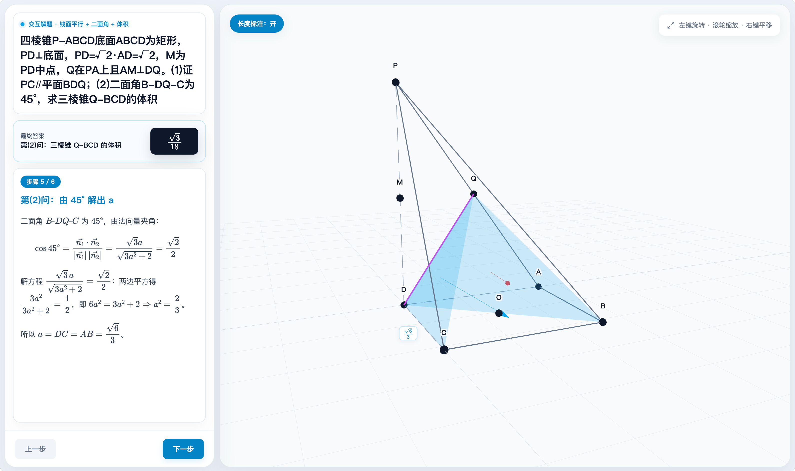

# edulab — AI 交互教学技能集

**简体中文** · [English](README.en.md)

一套面向学科教育的 Claude Code 技能集合。每个技能能把学科知识点**自动生成**为一个可直接在浏览器打开的交互教学网页——包含 Canvas 2D 动画 / Three.js 3D 场景、步进式讲解、侧栏知识点面板、可交互参数控制。

目前共 **14 个技能**，覆盖化学、信息技术、生物、地理、数学、物理、几何七大学科。所有生成的 HTML 均为自包含文件，可在浏览器直接打开使用。

## 安装

```bash
在workbuddy，codex, claude code，直接命令要求安装skill:https://github.com/liangdabiao/edulab
```


安装后，技能会在 workbuddy,Claude Code 、codex 中按学科关键词自动激活，也可手动调用。

---

## 技能总览

### 🧪 化学

#### edu-chem-reaction — 化学反应 3D 微观演示

**核心原理**：把单个化学反应做成自包含的微观 Three.js 3D 演示网页。左侧为可交互分子动画（拖拽滑块观看化学键断裂与生成、原子重新组合、分步高亮），右侧为 KaTeX 反应方程式、分步讲解、原子守恒计数器，可选能量-反应进程曲线。

**驱动机制**：sympy 精确计算核心自动配平方程（由元素矩阵零空间求整数计量数）、校验原子映射（反应物→产物原子的双射）、推导键的断/成。方程、几何、计数器同源一致。

**双引擎架构**：
- **morph 引擎**：原子各自飞向新搭档，展示原子守恒与重组，适合燃烧、化合/分解/置换、氧化还原
- **mechanism 引擎**：分子片段按关键帧刚体位移，展示催化剂、过渡态、离去基团，适合有机机理

**覆盖反应**：甲烷/氢气燃烧、电解水、钠与氯气氧化还原（电子转移可视化）、葡萄糖有氧氧化、酯化机理，涵盖初中基础到高中无机氧化还原与有机机理。

**输入方式**：文字题目 → 直接生成 | 上传图片 → 视觉识别后生成 | 随机出题 → 随机参数求解

#### edu-chem-tutorial — 化学步进式交互课程

**核心原理**：把非单一反应的化学课程（如氧化还原配平、金属活动性、电解质等）做成步进式交互教学网页。Canvas 2D 渲染，每步配有动画场景与侧栏知识点面板，支持播放/暂停/步进控制。

**架构**：`STEPS` 数组驱动步骤切换，`SCENES` 字典映射场景绘制函数，`__TUTORIAL_DATA__` 占位符注入模板。可选的 `sceneArgs.param` 提供交互式参数滑块（如调节角度观察变化）。

**典型课程**：氧化还原配平（化合价升降法 + 双线桥）、金属活动性顺序、电解质与非电解质、微观过程可视化

---

### 💻 信息技术 · 通用技术

#### edu-it — IT / 通用技术交互课程

**核心原理**：把信息技术与通用技术课程做成步进式交互教学网页，Canvas 2D 动画驱动多种教学场景——算法可视化（排序比较动画、查找范围高亮）、流程图绘制、神经网络结构、代码执行演示、硬件框图、数据图表等。

**场景库**：内建 20+ 种场景绘制器，包括排序算法（冒泡/选择/插入）、二分查找、流程图符号、神经网络、代码逐行高亮、Excel 图表、数据库 ER 图、计算机组成框图、网络拓扑图、设计流程、传感器-控制器-执行器示意图等。

**覆盖模块**：
- **算法**：冒泡排序、选择排序、插入排序、二分查找、算法复杂度
- **编程**：流程图、Python、Scratch、C++
- **数据与 AI**：Excel 处理、数据库、机器学习、语音识别、图像识别
- **硬件与网络**：计算机组成、网络基础
- **设计与电子**：设计流程、材料与工具、电子控制

**架构**：数据驱动模板 + `SCENES` 场景字典 + `sceneArgs.param` 交互滑块 + 深色主题

---

### 🧬 生物

#### edu-bio — 生物交互课程

**核心原理**：把生物学课程做成步进式交互教学网页。Canvas 2D 生物专用场景绘制器覆盖分子细胞到人体系统的多层次可视化。

**场景库**：8 个生物专用场景——动植物细胞结构（细胞器标注与功能介绍）、膜运输（扩散/主动运输动态）、DNA 双螺旋、细胞分裂（有丝分裂/减数分裂过程）、遗传图解（孟德尔杂交）、食物网/生态金字塔、人体生理系统（循环/呼吸/消化）、PCR 过程（温度循环与 DNA 扩增）。

**覆盖模块**：分子与细胞、遗传与进化、稳态与环境、生物技术、人体生理

---

### 🌍 地理

#### edu-geo — 地理交互课程

**核心原理**：把地理课程做成步进式交互教学网页。8 个地理专用 Canvas 2D 场景绘制器，覆盖自然地理到 GIS 技术的多层次可视化。

**场景库**：
- **globe_3d**：3D 地球经纬网，支持自转/公转模式，昼夜示意
- **atmosphere**：大气环流、气压带风带（全球/季风/季节性）
- **water_cycle**：水循环示意图（蒸发/降水/径流分步激活）
- **plate_tectonics**：板块构造横截面（汇聚/离散/转换）
- **population_pyramid**：人口金字塔图（数据驱动）
- **urban_model**：城市结构模型（同心圆/扇形/多核心）
- **map_chart**：中国/世界简图与地理标记
- **gis_layers**：GIS 图层叠加概念示意

**覆盖模块**：自然地理（地球运动、大气环流、水循环、板块构造）、人文地理（人口金字塔、城市结构）、区域地理（中国地理）、地理信息技术（RS、GPS、GIS）

---

### 📐 数学



#### edu-math-function — 函数图像交互教学

**核心原理**：三栏式交互教学网页——左栏题面 + 参数滑块（如系数 a、频率 ω、相位 φ）驱动实时重算的函数值、导数值、定积分面积；中栏 KaTeX 分步解析；右栏 Canvas 2D 动态函数图像画板（函数曲线 + 切线 + 区域着色 + 动点 + 网格坐标轴），叠加画笔涂鸦工具栏。

**交互特性**：参数变化时函数曲线实时重绘、切线跟随动点移动、定积分区域着色跟随范围变化。无需外部依赖。

#### edu-math-vectors — 二维向量交互教学

**核心原理**：三栏式交互教学网页——参数滑块（如角度 θ、长度比）驱动实时重算的向量量（模长、点积、夹角、分量）；中栏 KaTeX 分步解析；右栏 Canvas 2D 动态向量画板（矢量箭头 + 平行四边形法则 + 分量投影 + 向量链 + 网格坐标轴）。

**覆盖内容**：向量加法/减法、平行四边形法则、点积与夹角、向量分解、向量链合成


#### edu-math-stats — 概率统计交互教学

**核心原理**：三栏式交互教学网页——参数滑块驱动实时重算的统计量（均值、标准差、概率、百分位）；中栏 KaTeX 分步解析；右栏 Canvas 2D 统计画板（正态分布曲线、直方图、箱线图、散点图与回归线）。

**覆盖内容**：正态分布、直方图与频数分布、箱线图与五数概括、散点图与回归、排列组合

#### edu-math-logic — 集合逻辑交互教学

**核心原理**：三栏式交互教学网页，三种可视化模式一键切换：
- **文氏图**：2-3 集合圆圈图，交集着色，元素标签
- **真值表**：HTML 表格，2^n 行，表达式自动求值
- **逻辑门**：Canvas 绘制 AND/OR/NOT/NAND/NOR/XOR 门符号

**覆盖内容**：集合运算与文氏图表示、命题逻辑与真值表、逻辑电路与门符号、德摩根定律等

---

### ⚛ 物理

#### edu-physics — 2D 物理交互教学

**核心原理**：把二维物理场景做成三栏交互教学网页。左栏题面 + 滑块驱动实时物理量读数与守恒定律指示；中栏 KaTeX 分步解析；右栏 Canvas 2D 动态物理画板。

**场景能力**：质点轨迹、矢量箭头、波形、能量条、光线路径，叠加画笔涂鸦工具栏。无需外部物理引擎，通过坐标构造 + scalars 表达式 + trace/vector/constant 实现交互。

**覆盖场景**：力学（抛体/碰撞/斜面）、热学（p-V 图/分子动理论）、电磁学（电场线/等势面）、光学（反射/折射）、振动与波（简谐振动/波动）、原子物理、近代物理

#### edu-physics-3d — 3D 物理交互教学

**核心原理**：把需要三维展示的物理场景做成三栏交互教学网页。右栏使用 Three.js 3D 交互画板（球体/箭头/轨迹曲线，OrbitControls 可旋转缩放），CDN 加载，无需 Python 依赖。

**覆盖场景**：洛伦兹力与叉积、原子轨道与电子云、晶体结构、刚体旋转、3D 磁场与电磁波

**与 edu-physics 的关系**：edu-physics 负责所有二维可展示的场景（力学、热学、光学等），edu-physics-3d 专用于必须三维展示的场景，两者互补而非重叠。

---

### 📐 几何

#### edu-plane-geometry — 平面几何交互教学

**核心原理**：把一道平面几何定理或问题做成三栏交互教学网页。右栏 Canvas 2D 画板采取浅色背景、无坐标轴网格，还原课本纯几何风格。

**核心特色**：点支持几何构造语法（中点、垂足、交点、旋转、反射），标注系统独立声明（直角记号、等长标记、角弧标注），无需坐标计算即可定义几何关系。参数滑块驱动边长/角度/面积实时数值 + 定值/等式恒成立指示。

**与 edu-analytic-geometry 的区别**：本技能处理欧氏平面几何（纯几何风格），edu-analytic-geometry 处理解析几何（带坐标轴的圆锥曲线）。

#### edu-solid-geometry — 立体几何交互解题

**核心原理**：把一道立体几何题解成自包含的交互教学网页——左侧 MathJax 分步推导，右侧 Three.js 可交互 3D 模型。sympy 精确计算核心驱动一切。

**计算机制**（方案 A）：坐标、向量、最终答案全部由 `lib/geometry_kernel.py` 用 sympy 精确计算得出，根式自动化简，杜绝心算误差。同一套坐标既喂给解题文案，也喂给 Three.js 3D 渲染，保证"图、解、答"严格一致。

**3D 坐标约定**：数学坐标 z 轴向上，three.js 渲染坐标 y 轴向上，`kernel.to_three()` 负责转换。

**覆盖题型**：正方体/长方体、棱锥/棱柱、圆柱/圆锥上的——线面角、二面角、异面直线夹角、点到平面距离、体积、方向余弦与空间角。统一用"建系 + 向量法"。

**输入方式**：文字题目 → 直接生成 | 上传图片 → 视觉识别后生成 | 随机出题 → 随机参数求解，答案不规整自动重抽

#### edu-analytic-geometry — 解析几何交互解题

**核心原理**：把一道解析几何（圆锥曲线）题解成自包含的交互教学网页。基于 2D Canvas 画板 + KaTeX 的数据驱动交互引擎。

**交互机制**：参数滑块驱动派生构造（直线与曲线交点、曲线上动点、中心对称、切线……）与实时读数，配理论范围条（区间端点由"是否有真实直线取到"自动判定开/闭）或定值指示器。

**统一解法**：设含参直线 `x = my + c` → 联立方程组 → 韦达定理 → 换元/常数分离。sympy 精确计算全部中间量与最终答案。

**覆盖题型**：求标准方程、弦长、向量数量积取值范围/定值、三角形面积最值、定点、定值（斜率之积）、轨迹、切线、离心率——涵盖椭圆/双曲线/抛物线/圆。

**输入方式**：文字题目、随机出题、上传图片识别后生成

---

## 架构概览

14 个技能分为两大架构家族：

### 家族 A：教程模板型（Canvas 2D，步进式，无 sympy）

适用于以"讲解"为主的课程，强调可视化展示与步骤切换。

**技能**：edu-chem-tutorial、edu-it、edu-bio、edu-geo、edu-math-function、edu-math-vectors、edu-math-stats、edu-math-logic、edu-physics、edu-plane-geometry

**共同架构**：
- 单页 HTML，`__TUTORIAL_DATA__` 或 `__LESSON_DATA__` 占位符注入
- `STEPS` 数组定义课程步骤（标题、讲解内容、场景配置）
- `SCENES` 字典映射场景绘制函数（Canvas 2D），函数签名 `(ctx, W, H, time, args)`
- `sceneArgs.param` 提供交互式参数滑块
- 无外部依赖（MathJax/KaTeX 为可选 CDN 加载）

### 家族 B：计算内核型（sympy 精确驱动，Three.js / Canvas 2D）

适用于需要精确计算的"解题"场景，答案与可视化同源。

**技能**：edu-chem-reaction、edu-solid-geometry、edu-analytic-geometry、edu-physics-3d

**共同架构**：
- sympy（或物理计算）精确计算核心，自动推导答案与全部中间量
- 计算核心输出与 3D/2D 视觉坐标同源一致
- 支持三种输入方式：文字题目、随机出题、上传图片识别
- 内置自检：kernel 答案 == 答案卡 == 末步骤展示值


---

## 工作原理

所有技能遵循统一的数据驱动生成流程：

1. **AI 理解输入** — Claude Code 根据用户提供的文字/图片/关键词识别学科知识点或题目
2. **匹配技能激活** — 对应的 edu-* 技能自动激活，调用内置生成逻辑
3. **生成结构化数据** — 根据模板规格组装 `{lesson, steps, model/scenes}` 结构
4. **注入模板** — JSON 数据以数据岛形式（`<script id="lesson-data" type="application/json">`）注入 HTML 模板
5. **自检与交付** — 答案正确性验证通过后，产出独立 HTML 文件到用户工作目录

## License

[Apache-2.0](LICENSE)
