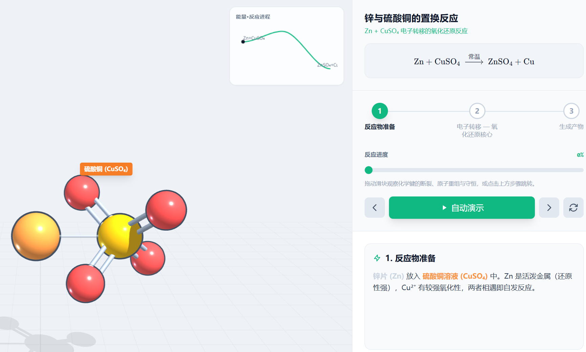
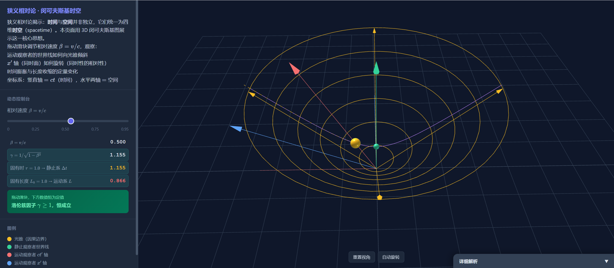
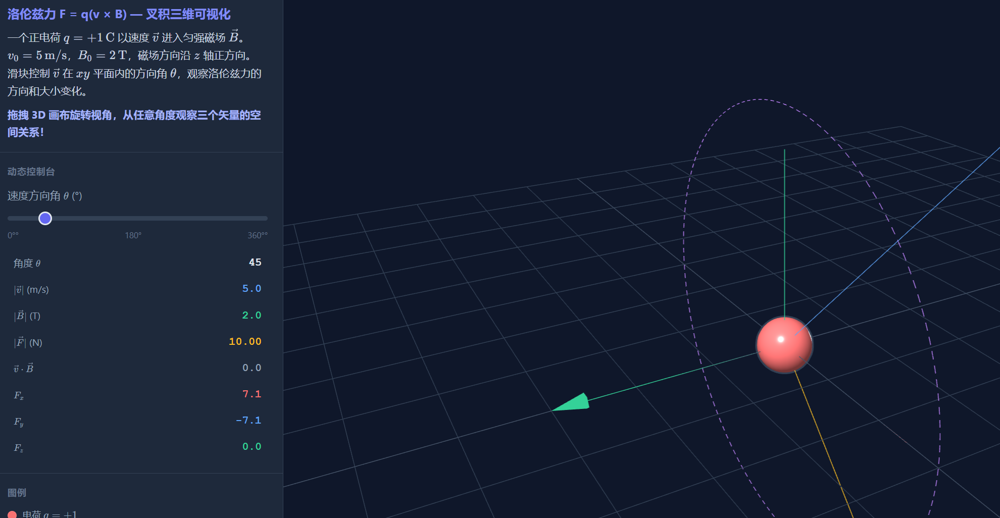
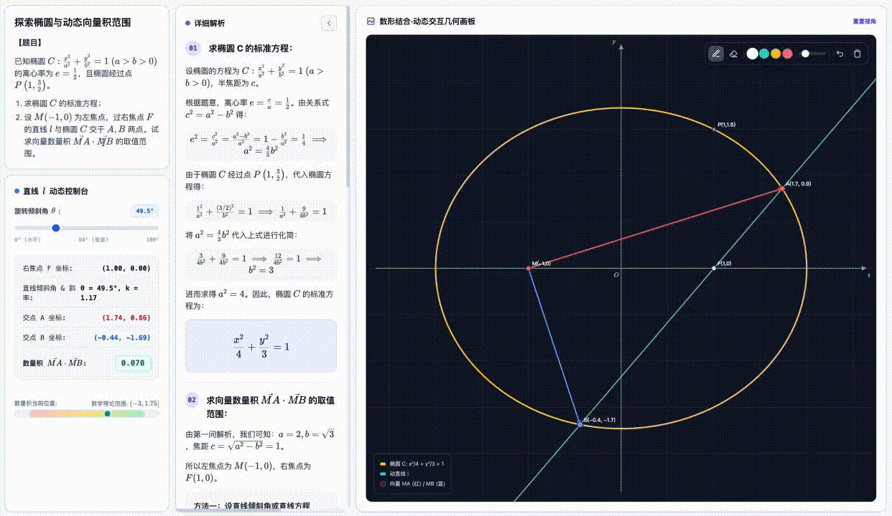
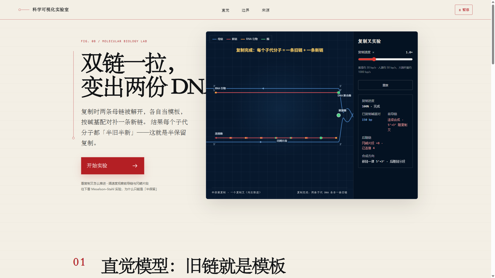
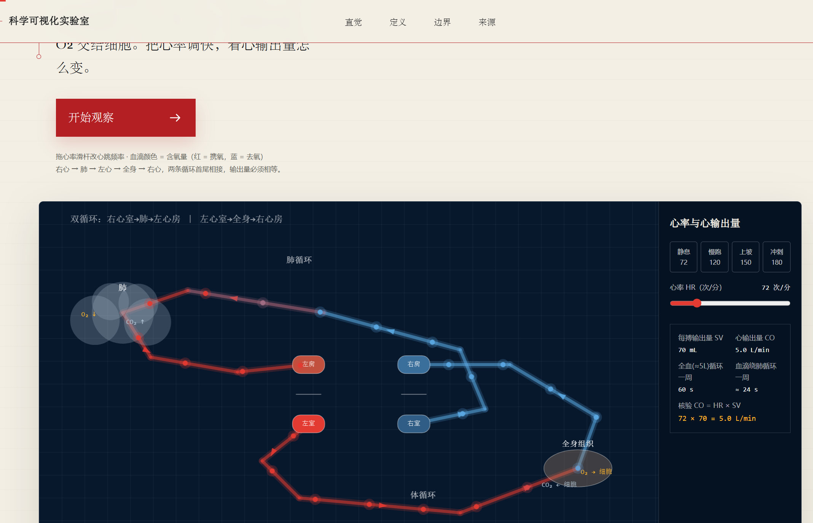

# edulab — AI 交互教学技能集

**简体中文** · [English](README.en.md)

互动课件skills, 增强版：wy51ai/edulab 。一套面向学科教育的 Agent skill 技能集合。每个技能能把学科知识点**自动生成**为一个可直接在浏览器打开的交互教学网页——包含 Canvas 2D 动画 / Three.js 3D 场景、步进式讲解、侧栏知识点面板、可交互参数控制。

目前共 **8 个技能**，覆盖化学、物理、几何三大解题/计算学科，以及一个面向通用科学可视化科普的独立技能。所有生成的 HTML 均为自包含文件，可在浏览器直接打开使用。

## 安装

```bash
在workbuddy，codex, claude code，直接命令要求安装skill:https://github.com/liangdabiao/edulab
```


安装后，技能会在 workbuddy,Claude Code 、codex 中按学科关键词自动激活，也可手动调用。

---

## 技能总览

### 🧪 化学

#### edu-chem-reaction — 化学反应 3D 微观演示



**核心原理**：把单个化学反应做成自包含的微观 Three.js 3D 演示网页。左侧为可交互分子动画（拖拽滑块观看化学键断裂与生成、原子重新组合、分步高亮），右侧为 KaTeX 反应方程式、分步讲解、原子守恒计数器，可选能量-反应进程曲线。

**驱动机制**：sympy 精确计算核心自动配平方程（由元素矩阵零空间求整数计量数）、校验原子映射（反应物→产物原子的双射）、推导键的断/成。方程、几何、计数器同源一致。

**双引擎架构**：
- **morph 引擎**：原子各自飞向新搭档，展示原子守恒与重组，适合燃烧、化合/分解/置换、氧化还原
- **mechanism 引擎**：分子片段按关键帧刚体位移，展示催化剂、过渡态、离去基团，适合有机机理

**覆盖反应**：甲烷/氢气燃烧、电解水、钠与氯气氧化还原（电子转移可视化）、葡萄糖有氧氧化、酯化机理，涵盖初中基础到高中无机氧化还原与有机机理。

**输入方式**：文字题目 → 直接生成 | 上传图片 → 视觉识别后生成 | 随机出题 → 随机参数求解

#### edu-chem-tutorial — 化学步进式交互课程

**核心原理**：把非单一反应的化学课程（如氧化还原配平、金属活动性、电解质等）做成步进式交互教学网页。Canvas 2D 渲染，每步配有动画场景与侧栏知识点面板，支持播放/暂停/步进控制。

**架构**：`STEPS` 数组驱动步骤切换，`SCENES` 字典映射场景绘制函数，`__TUTORIAL_DATA__` 占位符注入模板。可选的 `sceneArgs.param` 提供交互式参数滑块（如调节角度观察变化）。

**典型课程**：氧化还原配平（化合价升降法 + 双线桥）、金属活动性顺序、电解质与非电解质、微观过程可视化

---

### ⚛ 物理



#### edu-physics — 2D 物理交互教学

**核心原理**：把二维物理场景做成三栏交互教学网页。左栏题面 + 滑块驱动实时物理量读数与守恒定律指示；中栏 KaTeX 分步解析；右栏 Canvas 2D 动态物理画板。

**场景能力**：质点轨迹、矢量箭头、波形、能量条、光线路径，叠加画笔涂鸦工具栏。无需外部物理引擎，通过坐标构造 + scalars 表达式 + trace/vector/constant 实现交互。

**覆盖场景**：力学（抛体/碰撞/斜面）、热学（p-V 图/分子动理论）、电磁学（电场线/等势面）、光学（反射/折射）、振动与波（简谐振动/波动）、原子物理、近代物理

#### edu-physics-3d — 3D 物理交互教学



**核心原理**：把需要三维展示的物理场景做成三栏交互教学网页。右栏使用 Three.js 3D 交互画板（球体/箭头/轨迹曲线，OrbitControls 可旋转缩放），CDN 加载，无需 Python 依赖。

**覆盖场景**：洛伦兹力与叉积、原子轨道与电子云、晶体结构、刚体旋转、3D 磁场与电磁波

**与 edu-physics 的关系**：edu-physics 负责所有二维可展示的场景（力学、热学、光学等），edu-physics-3d 专用于必须三维展示的场景，两者互补而非重叠。

---

### 📐 几何


#### edu-plane-geometry — 平面几何交互教学


**核心原理**：把一道平面几何定理或问题做成三栏交互教学网页。右栏 Canvas 2D 画板采取浅色背景、无坐标轴网格，还原课本纯几何风格。

**核心特色**：点支持几何构造语法（中点、垂足、交点、旋转、反射），标注系统独立声明（直角记号、等长标记、角弧标注），无需坐标计算即可定义几何关系。参数滑块驱动边长/角度/面积实时数值 + 定值/等式恒成立指示。

**与 edu-analytic-geometry 的区别**：本技能处理欧氏平面几何（纯几何风格），edu-analytic-geometry 处理解析几何（带坐标轴的圆锥曲线）。

#### edu-solid-geometry — 立体几何交互解题


**核心原理**：把一道立体几何题解成自包含的交互教学网页——左侧 MathJax 分步推导，右侧 Three.js 可交互 3D 模型。sympy 精确计算核心驱动一切。

**计算机制**（方案 A）：坐标、向量、最终答案全部由 `lib/geometry_kernel.py` 用 sympy 精确计算得出，根式自动化简，杜绝心算误差。同一套坐标既喂给解题文案，也喂给 Three.js 3D 渲染，保证"图、解、答"严格一致。

**3D 坐标约定**：数学坐标 z 轴向上，three.js 渲染坐标 y 轴向上，`kernel.to_three()` 负责转换。

**覆盖题型**：正方体/长方体、棱锥/棱柱、圆柱/圆锥上的——线面角、二面角、异面直线夹角、点到平面距离、体积、方向余弦与空间角。统一用"建系 + 向量法"。

**三种使用方式**：

| 方式 | 操作 | 说明 |
|------|------|------|
| **文字题目** | 直接输入题目文本 | 提取题干后自动求解，适合已知题目的场景 |
| **上传图片** | 上传题目截图/照片 | 通过视觉识别读取题目，回显确认后再求解 |
| **随机出题** | 由系统随机生成参数 | 自动求解并验证答案规范性，不规整时自动重抽 |

使用示例：
```
用户：在正方体 ABCD-A₁B₁C₁D₁ 中，求 A₁B 与平面 A₁BC₁ 所成角的正弦值
→ 技能自动识别题型、建系、计算、生成交互网页
```

#### edu-analytic-geometry — 解析几何交互解题



**核心原理**：把一道解析几何（圆锥曲线）题解成自包含的交互教学网页。基于 2D Canvas 画板 + KaTeX 的数据驱动交互引擎。

**交互机制**：参数滑块驱动派生构造（直线与曲线交点、曲线上动点、中心对称、切线……）与实时读数，配理论范围条（区间端点由"是否有真实直线取到"自动判定开/闭）或定值指示器。

**统一解法**：设含参直线 `x = my + c` → 联立方程组 → 韦达定理 → 换元/常数分离。sympy 精确计算全部中间量与最终答案。

**覆盖题型**：求标准方程、弦长、向量数量积取值范围/定值、三角形面积最值、定点、定值（斜率之积）、轨迹、切线、离心率——涵盖椭圆/双曲线/抛物线/圆。

**输入方式**：文字题目、随机出题、上传图片识别后生成

---

### 🔬 科学可视化 · 科普

#### edu-sci-viz — 单文件互动科普页




**核心原理**：把任何数学或科学概念（日食、月食、太阳系、四季、月相、潮汐、卫星轨道、板块运动、光的折射、彩虹、时区、极昼极夜、氧化还原、铝热反应……）做成一页"单文件互动科普 HTML"。采用编辑部科学手册风（暖米白纸底 + 深海军蓝实验区 + 红/琥珀强调 + 宋体大标题 + 等宽参数）。

**核心流程（8 步）**：
1. **事实核验**：先查权威来源（官方页面、原始论文、可靠综述）再动手；禁止虚构定理、数字、引文和结论
2. **直觉模型**：把抽象概念转成可操作的画面，先建立"这道题到底在问什么"的直觉
3. **正式定义**：直觉之后给出准确定义与关键概念区分
4. **互动实验**：参数滑杆 + 实时反馈；拖动旋转、滚轮缩放、重置视角、暂停
5. **边界说明**：明确演示只用于建立直觉；单列"这个模型简化了什么"
6. **来源追溯**：所有重要结论回到官方/原始论文/可靠综述，页面末尾列出来源链接
7. **单文件组装**：复制 `templates/board-sci.html`，替换叙事 HTML、实验台与控制区、场景模块
8. **自检交付**：浏览器实测 + 控制台 + 响应式；交付单个 `.html` 到当前工作目录

**渲染策略**：三维必须（如日地月几何、轨道）用 Three.js + OrbitControls；二维够用的用 HTML Canvas。

**视觉规范**：暖米白 `#f3efe5` 纸底、深海军蓝 `#07182d` 实验区、红 `#b41f24` + 琥珀 `#e5a526` 强调；大量细线、编号、坐标网格和留白；禁止大面积渐变、玻璃卡片、荧光科技风和过度圆角。

**触发词**：科学可视化、可视化科普、互动科学实验、科学交互演示、像挂谷猜想那样做个科普页。主题词：日食、月食、潮汐、卫星轨道、板块运动、折射、全反射、太阳系、四季、月相、彩虹、ENSO、厄尔尼诺、洋流、氧化还原、配平、铝热反应、镁条燃烧。

**与现有技能的关系**：完全独立，不并入任何现有 edu-* 技能。领域交叉时（如日食、潮汐属地理；折射、轨道属物理）可与对应技能互补——本技能做"叙事科普"，现有技能做"题面 + 分步解析 + 画板"的课件。

## 架构概览

8 个技能分为三大架构家族：

### 家族 A：教程模板型（Canvas 2D，步进式，无 sympy）

适用于以"讲解"为主的课程，强调可视化展示与步骤切换。

**技能**：edu-chem-tutorial、edu-physics、edu-plane-geometry

**共同架构**：
- 单页 HTML，`__TUTORIAL_DATA__` 或 `__LESSON_DATA__` 占位符注入
- `STEPS` 数组定义课程步骤（标题、讲解内容、场景配置）
- `SCENES` 字典映射场景绘制函数（Canvas 2D），函数签名 `(ctx, W, H, time, args)`
- `sceneArgs.param` 提供交互式参数滑块
- 无外部依赖（MathJax/KaTeX 为可选 CDN 加载）

### 家族 B：计算内核型（sympy 精确驱动，Three.js / Canvas 2D）

适用于需要精确计算的"解题"场景，答案与可视化同源。

**技能**：edu-chem-reaction、edu-solid-geometry、edu-analytic-geometry、edu-physics-3d

**共同架构**：
- sympy（或物理计算）精确计算核心，自动推导答案与全部中间量
- 计算核心输出与 3D/2D 视觉坐标同源一致
- 支持三种输入方式：文字题目、随机出题、上传图片识别
- 内置自检：kernel 答案 == 答案卡 == 末步骤展示值

### 家族 C：科普单文件型（编辑部科学手册风，单文件自包含）

适用于"叙事科普"型主题，先建立直觉再给定义，强调事实核验与来源追溯。

**技能**：edu-sci-viz

**共同架构**：
- 单文件自包含 `.html`，无构建工具、无 Python 依赖
- 内置设计系统 + 页面骨架 + 通用运行时 + importmap
- 模板 `templates/board-sci.html` 走"事实核验 → 直觉模型 → 正式定义 → 互动实验 → 边界说明 → 来源追溯 → 单文件组装 → 自检交付"八步流程
- 三维主题用 Three.js + OrbitControls（CDN importmap），二维主题用 HTML Canvas
- 场景模块接口 `window.SciScene = { update(dt) }`，由运行时每帧调用


---

## 工作原理

所有技能遵循统一的数据驱动生成流程：

1. **AI 理解输入** — Claude Code 根据用户提供的文字/图片/关键词识别学科知识点或题目
2. **匹配技能激活** — 对应的 edu-* 技能自动激活，调用内置生成逻辑
3. **生成结构化数据** — 根据模板规格组装 `{lesson, steps, model/scenes}` 结构
4. **注入模板** — JSON 数据以数据岛形式（`<script id="lesson-data" type="application/json">`）注入 HTML 模板
5. **自检与交付** — 答案正确性验证通过后，产出独立 HTML 文件到用户工作目录

## License

[Apache-2.0](LICENSE)

感谢 https://linux.do 社区